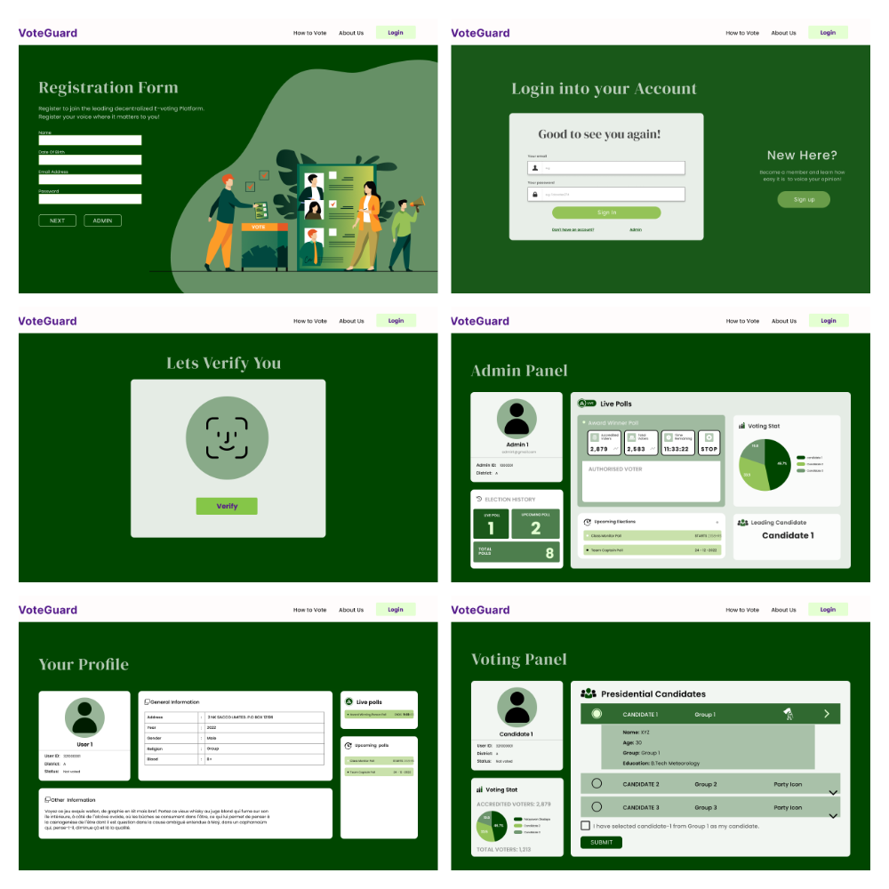

# 🗳️ VoteGuard — Secure E-Voting System Using Facial Recognition

VoteGuard is an end-to-end online voting platform built with **Flask** that replaces traditional password-only authentication with **face-verified voting**. Every voter enrolls their face at signup, and every vote is gated behind a **liveness challenge** (blink / turn head) plus **face-matching**, so a photo, a screen recording, or a stolen password alone can't cast a vote on someone's behalf.

The system has two roles — **Admin** (creates and manages elections) and **Voter** (registers, gets verified, and votes) — and gives both real-time analytics on poll results via auto-generated charts.

> 📌 Repo: [VoteGuard-Secure-E-Voting-System-Using-Facial-Recognition](https://github.com/ompatel7572/VoteGuard-Secure-E-Voting-System-Using-Facial-Recognition)

---

## 📸 Screenshots

<p align="center">

</p>

---

## ✨ Key Features

### 🔐 Facial-Recognition Authentication
- **Face enrollment (`/face`)** — on first login, the voter's browser webcam captures **5 photos** (via `getUserMedia` + `<canvas>`, no plugins needed). Each frame is sent to the server as a base64 data-URL.
- Faces are detected and embedded using **[InsightFace](https://github.com/deepinsight/insightface) (`buffalo_l`)** — an SCRFD detector + **ArcFace** recognition model — instead of `dlib`/`face_recognition`. Detection + embedding happen in a single `app.get(frame)` call.
- If multiple faces appear in a frame (bystanders), the **largest bounding box** is used.
- Embeddings (`normed_embedding`, L2-normalized) are stored per-user in a `pickle` file, enabling fast **cosine-similarity matching** later.

### 🕵️ Liveness Detection (Anti-Spoofing)
Before every vote, the voter must pass a **randomized challenge-response check** — this is what stops someone from voting using a static photo or a replayed video of the enrolled user:
- The server picks one of **`blink twice`**, **`turn head left`**, or **`turn head right`** at random and stores it **server-side in the session** (tied to that specific poll ID) — the client only ever sees the human-readable label, never anything the check itself relies on, so the challenge can't be spoofed by tampering with the request.
- The browser records **~25 frames over ~2.5 seconds** while the user performs the action and submits them all at once.
- **Blink detection** — an EAR-like (eye-aspect-ratio) signal is computed per frame from InsightFace's 106-point landmarks, geometrically clustered around each eye center rather than hardcoded indices (robust across InsightFace versions). Open→Closed→Open transitions are counted as completed blinks.
- **Head-turn detection** — yaw angle is estimated per frame via `cv2.solvePnP` (EPNP + iterative refinement) against a generic 3D face model, using the detector's 5-point keypoints.
- The challenge is **single-use**: it's cleared from the session after each attempt so captured frames can't be replayed against a later prompt.
- **Only if the liveness challenge passes** does the system move on to face matching — the most front-facing frame (smallest yaw) is compared via cosine similarity against the voter's enrolled embeddings.

### 🗳️ Voting Workflow
- Voters only see polls they're **eligible for**, matched by their registered email against each poll's allow-list.
- **One vote per person per poll**, enforced server-side via a `VoteHistory` table (not just UI hiding).
- Server-side validation rejects any submitted option that isn't one of the poll's actual candidates, and rejects votes after a poll's expiry — all expiry comparisons are done consistently in **UTC** to avoid timezone bugs.
- A **"Thank You"** page shows the current standings immediately after voting.

### 🧑‍💼 Admin / Election Management
- **Create Poll** — set the question, candidates (comma-separated), and an **expiry date/time**.
- **Voter allow-list** — supply eligible voter emails either by typing them in, or by **uploading a CSV/Excel file** (parsed with `pandas`; emails are normalized to lowercase and deduplicated).
- **Admin dashboard** — shows total polls created, currently-live poll count, and a live snapshot (pie chart + leading candidate + time remaining) of the most recent election.

### 📊 Live Analytics & Results
- Poll results are rendered server-side as **pie charts using Matplotlib** (`Agg` backend, so it runs headless), encoded to base64 PNG and embedded directly in the page — no client-side charting library needed.
- While a poll is still open, voters see a **live countdown** (`HH:MM:SS` remaining) instead of results.
- Once a poll **expires**, the results page unlocks and displays the **winning candidate**, their vote count, and the full vote breakdown.

---

## 🏗️ Tech Stack

| Layer | Technology |
|---|---|
| Backend | Flask, Flask-SQLAlchemy |
| Database | SQLite (via SQLAlchemy ORM) |
| Auth | Werkzeug password hashing, Flask sessions |
| Face Detection & Recognition | InsightFace (`buffalo_l`: SCRFD + ArcFace), OpenCV, NumPy |
| Liveness / Head Pose | OpenCV `solvePnP` (EPNP + iterative), InsightFace 106-point landmarks |
| Data Import | pandas (CSV/Excel voter allow-lists) |
| Charts | Matplotlib (server-rendered, base64-embedded) |
| Frontend | HTML/CSS (Poppins/DM Serif Display), vanilla JS (`getUserMedia`, `<canvas>`, `fetch`/form submission) |

---

## 🧭 How a Vote Actually Happens (End-to-End)

1. **Signup** (`/signup`) → name, DOB, email, password. Optional admin self-registration checkbox.
2. **First login** → voter is routed straight to **face enrollment** (`/face`); admin is routed to **create their first poll**.
3. **Face enrollment** → 5 webcam captures → ArcFace embeddings extracted and saved.
4. **Dashboard** (`/dashboard`) → voter sees only polls their email is allow-listed for and that haven't expired.
5. **Select a poll** (`/redirect_to_poll/<id>`) → server picks a random liveness challenge and stashes it in the session.
6. **Verify** (`/verifyface/<id>`) → browser records ~25 frames while the user performs the challenge → server checks liveness, then checks face match.
7. **Cast vote** (`/submit_vote`) → server re-validates eligibility, expiry, and option validity, then records the vote (one-time only).
8. **Thank You / Results** → live tally shown immediately after voting; full pie-chart breakdown unlocks once the poll expires.

---

## ⚙️ Getting Started

### Prerequisites
- Python 3.9+
- A webcam-enabled browser (Chrome/Edge/Firefox) for face enrollment & voting
- `pip` packages: `flask`, `flask-sqlalchemy`, `werkzeug`, `pandas`, `matplotlib`, `opencv-python`, `numpy`, `insightface`, `onnxruntime` (or `onnxruntime-gpu` if you have a CUDA-capable GPU)

### Installation
```bash
git clone https://github.com/ompatel7572/VoteGuard-Secure-E-Voting-System-Using-Facial-Recognition.git
cd VoteGuard-Secure-E-Voting-System-Using-Facial-Recognition

python -m venv venv
source venv/bin/activate        # Windows: venv\Scripts\activate

pip install flask flask-sqlalchemy werkzeug pandas matplotlib opencv-python numpy insightface onnxruntime
```

### Environment Variables
```bash
export SECRET_KEY="your-random-secret-key"   # Flask session signing key
```

### Run
```bash
python app.py
```
The app will be available at `http://127.0.0.1:5000`. The SQLite database and InsightFace model files are created automatically on first run (InsightFace downloads its `buffalo_l` model weights the first time it initializes).

### Sample Voter Allow-List
A demo CSV (`allowed_emails_demo.csv`) is included, showing the expected format for the "upload eligible voters" feature on the Create Poll page — a single email-per-row column:
```
Emails
alice@example.com
bob@example.com
...
```

---

## ⚠️ Notes & Limitations

This project was built as an academic/portfolio demonstration of combining biometric auth with a voting workflow — a few things worth knowing before treating it as production-ready:

- **Matching thresholds** (`MATCH_THRESHOLD`, blink EAR thresholds, yaw-turn threshold) are tuned generically and should be **re-calibrated against real test footage** before relying on them for anything higher-stakes than a class project.
- Face embeddings are stored in a local **pickle file**, not encrypted at rest — for real deployments, this (and the SQLite DB) should move to a properly secured datastore.
- Liveness detection here is a **software-only, single-camera** challenge-response check (blink/head-turn), which raises the bar against simple photo/video spoofing but is not equivalent to hardware-based liveness (e.g. depth sensors) used in production biometric systems.

---

## 🛣️ Possible Future Improvements
- Move face embeddings from pickle → encrypted database storage
- Add email OTP as a second factor alongside face verification
- Admin ability to edit/delete polls and view per-voter audit logs
- Dockerize the app (bundling ONNX model weights) for one-command setup
- Migrate charts to an interactive frontend library (Chart.js/Plotly) for live-updating results

---

## 📄 License

This project is licensed under the **MIT License** — see the [LICENSE](LICENSE) file for details.

## 🙌 Acknowledgements
- [InsightFace](https://github.com/deepinsight/insightface) — SCRFD detection & ArcFace recognition
- [OpenCV](https://opencv.org/) — head-pose estimation (`solvePnP`)
- [Flask](https://flask.palletsprojects.com/) & [Flask-SQLAlchemy](https://flask-sqlalchemy.palletsprojects.com/)
